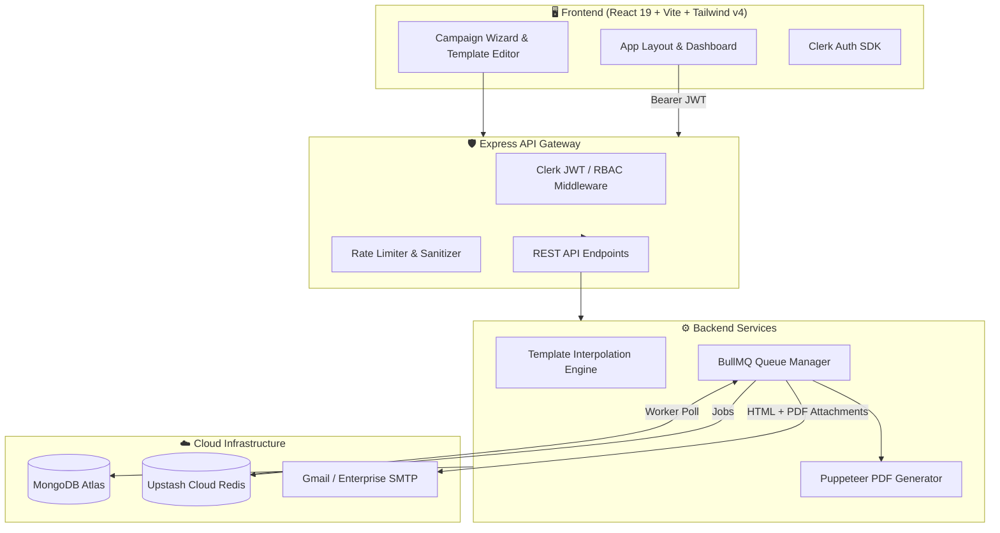

# 🚀 HireFlow — Enterprise Recruitment & Email Automation Platform

<div align="center">


[](https://vite.dev)
[](https://nodejs.org)
[](https://tailwindcss.com)
[](https://www.mongodb.com)
[](https://upstash.com)
[](https://clerk.com)

<p align="center">
  <b>Automate Candidate Outreach, Offer Letter Contracts & Mass Email Campaigns with Real-Time Telemetry.</b>
</p>

[Explore Features](#-key-features) • [System Architecture](#-system-architecture) • [Quick Start](#-quick-start) • [Automation Guide](#-automation-workflow-guide) • [API & Security](#-security--rate-limiting)

</div>

---

## 📖 Overview

**HireFlow** is an enterprise-grade recruitment automation system built to streamline candidate lifecycle workflows. It enables Talent Acquisition teams to ingest candidate data, build dynamic HTML email templates, generate signed PDF offer contracts on the fly, and execute reliable, rate-limited email campaigns with BullMQ queues and real-time delivery telemetry.

<div align="center">
  
</div>

---

## ✨ Key Features

| Feature | Description |
| :--- | :--- |
| 👥 **Candidate CRM** | Import applicants via CSV or manual entry with stage tracking (*Applied*, *Interview*, *Offer Sent*, *Hired*). |
| 📝 **Rich Template Engine** | Dynamic mustache-style templating (`{{candidate_name}}`, `{{job_title}}`, `{{salary}}`, `{{start_date}}`). |
| 📄 **Dynamic PDF Generation** | Headless Chrome engine creates customized, professional PDF contracts & offer letters on the fly. |
| ⚡ **Resilient Queue Engine** | Redis & BullMQ worker pool with exponential backoff, rate-limiting, and idempotency guarantees. |
| 📊 **Real-time Analytics** | Live tracking of email delivery states, open rates, dispatch logs, and security audit trails. |
| 🔐 **Enterprise Auth & RBAC** | Multi-tenant Clerk authentication with fallback development mock mode. |

---

## 🏗️ System Architecture



---

## 🛠️ Tech Stack

### **Frontend**
* **Framework:** React 19 + Vite 7
* **Styling:** Tailwind CSS v4 + Framer Motion
* **Routing:** React Router v7
* **Icons & Animation:** Lucide React, Canvas-Confetti, Lenis Smooth Scroll
* **Auth:** `@clerk/clerk-react`

### **Backend**
* **Runtime:** Node.js (ES Modules) + Express
* **Database:** MongoDB Atlas + Mongoose
* **Queues & Jobs:** BullMQ + Upstash Redis (ioredis with TLS)
* **Document Engine:** Puppeteer Headless Chromium
* **Email Engine:** Nodemailer + SMTP
* **Security:** Helmet, CORS, Express-Rate-Limit, Sanitize-HTML, Zod

---

## 🚀 Quick Start

### 1. Clone the Repository
```bash
git clone https://github.com/your-username/HireFlow---Email-Automation.git
cd HireFlow---Email-Automation
```

### 2. Configure Environment Variables

#### **Server Setup** (`server/.env`):
```env
PORT=5000
NODE_ENV=development
CLIENT_URL=http://localhost:5173

# Database
MONGODB_URI=mongodb+srv://<username>:<password>@cluster.mongodb.net/hireflow?retryWrites=true&w=majority

# Redis (Upstash Cloud or Local)
REDIS_URL=rediss://default:<upstash_password>@<your-upstash-host>.upstash.io:6379

# Clerk Authentication
CLERK_PUBLISHABLE_KEY=pk_test_...
CLERK_SECRET_KEY=sk_test_...

# SMTP Credentials
SMTP_HOST=smtp.gmail.com
SMTP_PORT=587
SMTP_SECURE=false
SMTP_USER=your-email@gmail.com
SMTP_PASSWORD=your-gmail-app-password
SMTP_FROM="HireFlow" <your-email@gmail.com>
```

#### **Client Setup** (`client/.env`):
```env
VITE_CLERK_PUBLISHABLE_KEY=pk_test_...
VITE_API_BASE_URL=http://localhost:5000/api
```

### 3. Install Dependencies & Run

#### Start Backend:
```bash
cd server
npm install
npm run dev
```

#### Start Frontend:
```bash
cd ../client
npm install
npm run dev
```

Open `http://localhost:5173` in your browser.

---

## 🎯 Automation Workflow Guide

```
  1. Add Candidates       2. Choose Templates      3. Launch Campaign       4. Live Telemetry
┌──────────────────┐    ┌────────────────────┐   ┌───────────────────┐   ┌──────────────────┐
│  Import CSV or   │ ──►│ Select Email HTML  │──►│ BullMQ Dispatches │──►│ Live Status:     │
│  Manual Profile  │    │ & PDF Contract Doc │   │ with Backoff & TLS│   │ Sent / Delivered │
└──────────────────┘    └────────────────────┘   └───────────────────┘   └──────────────────┘
```

1. **Import Candidates**: Go to `/candidates` → Click **"Import CSV"** or manually add applicants with role & department details.
2. **Setup Templates**:
   * **Email Templates** (`/email-templates`): Write customized messages with placeholders like `{{candidate_name}}` and `{{job_title}}`.
   * **Document Templates** (`/document-templates`): Build formal offer letters that render into high-resolution PDFs.
3. **Launch a Campaign** (`/campaigns/create`): Select target candidates, attach your templates, review the live preview, and launch.
4. **Inspect Analytics** (`/analytics` & `/email-logs`): Monitor email status (*Queued*, *Processing*, *Delivered*, *Failed*) in real time.

---

## 🛡️ Security & Reliability

* **Idempotent Job Processing:** Every dispatch job uses a composite idempotency key (`camp_{id}_cand_{id}`) to prevent duplicate email sends.
* **XSS Sanitization:** All email HTML is sanitized with `sanitize-html` to prevent malicious markup injection.
* **Rate Limiting:** API endpoints are protected against brute-force and request flooding.
* **Audit Logging:** System actions (campaign creation, template modifications, deletions) are recorded with timestamped metadata.

---

## 🌐 Deployment

| Target | Platform | Root Directory | Build Command | Output / Start |
| :--- | :--- | :--- | :--- | :--- |
| **Frontend** | [Vercel](https://vercel.com) | `client` | `npm run build` | `dist` |
| **Backend** | [Render](https://render.com) | `server` | `npm install` | `npm start` |
| **Database** | [MongoDB Atlas](https://mongodb.com) | Cloud | — | Managed Cluster |
| **Cache/Queue** | [Upstash Redis](https://upstash.com) | Cloud | — | TLS Endpoint |

---

## 📄 License

This project is licensed under the [MIT License](LICENSE).
