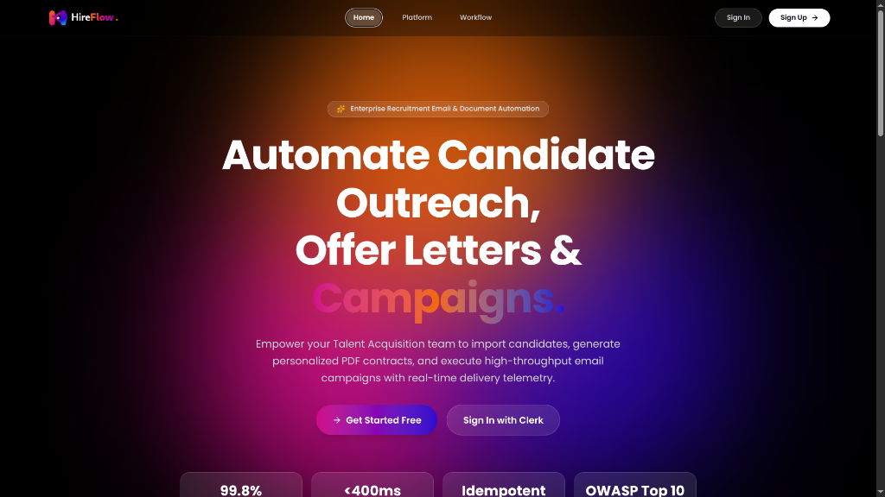
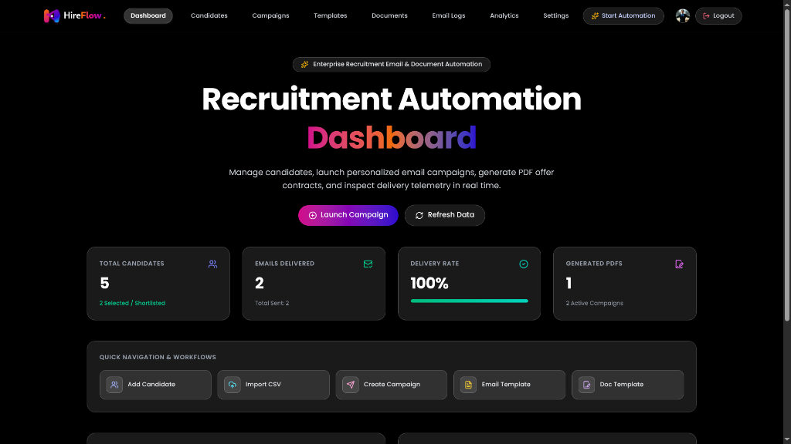

<div align="center">

# ⚡ Thodar
### Enterprise Recruitment Email & Document Automation Platform

An end-to-end recruitment outreach engine designed for modern Talent Acquisition teams. Automate candidate communication, generate dynamic PDF offer contracts, and dispatch high-throughput email campaigns with real-time delivery telemetry.

<br />

[](https://reactjs.org/)
[](https://vitejs.dev/)
[](https://tailwindcss.com/)
[](https://nodejs.org/)
[](https://mongodb.com/)
[](https://redis.io/)
[](https://clerk.com/)

</div>

---

## 📸 Product Previews

### 🌐 Landing Page


### 📊 Recruitment Automation Dashboard


---

## 🚀 Core Features

- 👥 **Candidate Hub**: Manage candidate profiles, filter by hiring pipeline stages, and bulk import candidates via CSV.
- 📝 **Dynamic Template Engine**: Create rich HTML email templates and document templates with handlebars-style placeholders (`{{candidate_name}}`, `{{role}}`, `{{salary}}`).
- 📄 **Automated PDF Generation**: Headless Chrome (Puppeteer) engine dynamically generates branded offer letters and NDA contracts per recipient.
- ⚡ **Asynchronous Campaign Queue**: High-throughput background processing powered by **BullMQ** and **Redis** with rate limiting, exponential backoffs, and idempotency keys.
- 📬 **Reliable Email Dispatch**: SMTP transport (Gmail/SendGrid/SES) with HTML sanitization, DKIM/SPF readiness, and automatic attachment linking.
- 📈 **Delivery Telemetry & Audit Logs**: Real-time status tracking (Queued, Sent, Delivered, Failed) and security audit trail.
- 🔐 **Enterprise Auth & RBAC**: Secure authentication powered by **Clerk** supporting Admin, Recruiter, and Reviewer roles.

---

## 🏗️ System Architecture

```text
┌────────────────────────────────────────────────────────┐
│                   React 19 Frontend                    │
│           (Tailwind v4 • Lucide • Vite • Clerk)        │
└───────────────────────────┬────────────────────────────┘
                            │  HTTPS / REST API
┌───────────────────────────▼────────────────────────────┐
│                  Node.js / Express API                 │
│         (Helmet • Rate Limiting • RBAC Guards)         │
└──────┬────────────────────┬────────────────────┬───────┘
       │                    │                    │
┌──────▼──────┐      ┌──────▼──────┐      ┌──────▼──────┐
│   MongoDB   │      │   Upstash   │      │  Puppeteer  │
│    Atlas    │      │ Redis Queue │      │ PDF Engine  │
│ (Data/Logs) │      │  (BullMQ)   │      │ (Contracts) │
└─────────────┘      └──────┬──────┘      └─────────────┘
                            │
                     ┌──────▼──────┐
                     │ SMTP Server │ ──► Live Candidate Inbox
                     │  (Nodemailer)│
                     └─────────────┘
```

---

## 🛠️ Tech Stack

| Layer | Technologies |
| :--- | :--- |
| **Frontend** | React 19, Vite, Tailwind CSS v4, Framer Motion, Lucide Icons, Axios |
| **Authentication** | Clerk Auth (`@clerk/clerk-react` & `@clerk/express`) |
| **Backend API** | Node.js (ES Modules), Express.js, Helmet, Morgan, CORS, Zod |
| **Queue & Cache** | BullMQ, ioredis, Upstash Cloud Redis |
| **Database** | MongoDB Atlas, Mongoose ODM |
| **Document Generation** | Puppeteer (Headless Chromium PDF generation) |
| **Email Transport** | Nodemailer (SMTP / Gmail App Passwords / SendGrid) |

---

## 🔄 How the Automation Works

1. **Import Candidates**: Upload a CSV file or add candidates manually with custom attributes (Role, Salary, Department).
2. **Design Templates**: Define reusable email bodies and PDF contract layouts with dynamic variables.
3. **Launch Campaign**: Select target candidates, choose an email template + document template, and start the campaign.
4. **Queue & Background Worker**: 
   - BullMQ breaks the campaign into idempotent candidate jobs.
   - Puppeteer renders and stores a personalized PDF attachment.
   - Nodemailer dispatches the email via SMTP.
5. **Real-time Telemetry**: Delivery metrics and audit logs update automatically on your dashboard.

---

## 💻 Getting Started

### 1. Clone the Repository
```bash
git clone https://github.com/your-username/Thodar---Email-Automation.git
cd Thodar---Email-Automation
```

### 2. Configure Backend Environment
Navigate to `server` and create a `.env` file:
```bash
cd server
cp .env.example .env
```

Fill in your configuration:
```env
PORT=5000
NODE_ENV=development
CLIENT_URL=http://localhost:5173

# MongoDB Atlas
MONGODB_URI=mongodb+srv://<username>:<password>@cluster.mongodb.net/thodar?retryWrites=true&w=majority

# Upstash Redis
REDIS_URL=rediss://default:<password>@<your-upstash-host>.upstash.io:6379

# Clerk Authentication
CLERK_PUBLISHABLE_KEY=pk_test_your_clerk_publishable_key
CLERK_SECRET_KEY=sk_test_your_clerk_secret_key

# SMTP Credentials
SMTP_HOST=smtp.gmail.com
SMTP_PORT=587
SMTP_SECURE=false
SMTP_USER=your_email@gmail.com
SMTP_PASSWORD=your_gmail_app_password
SMTP_FROM="Thodar" <your_email@gmail.com>
```

### 3. Configure Frontend Environment
Navigate to `client` and create a `.env` file:
```bash
cd ../client
cp .env.example .env
```

```env
VITE_CLERK_PUBLISHABLE_KEY=pk_test_your_clerk_publishable_key
VITE_API_BASE_URL=http://localhost:5000/api
```

### 4. Install Dependencies & Run

**Start Server:**
```bash
cd server
npm install
npm run dev
```

**Start Client:**
```bash
cd ../client
npm install
npm run dev
```

Visit **`http://localhost:5173`** in your browser.

---

## 🚢 Deployment

- **Frontend**: Deploy on **Vercel** or **Netlify** with Root Directory set to `client`.
- **Backend**: Deploy on **Render**, **Railway**, or **Fly.io** with Root Directory set to `server`.
- **Database & Queue**: Hosted seamlessly with **MongoDB Atlas** and **Upstash Redis**.

---

## 📄 License

This project is licensed under the [MIT License](LICENSE).
